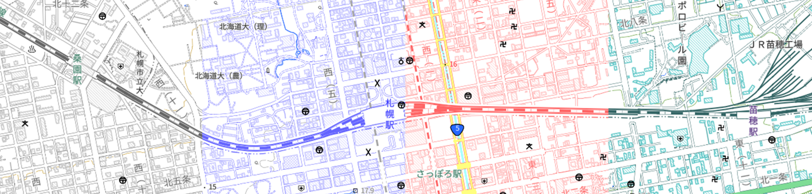

# gsi-style-samples
地理院地図Vectorのオリジナルスタイルサンプル集

[gsi-style-color-analysisレポジトリ](https://github.com/mghs15/gsi-style-color-analysis)で作成したスタイル置き場です。

## サンプルスタイル
「おすすめの地図」から選択できます。
* 標準地図：地理院地図Vectorの標準地図そのままです。
* ベース：地理院地図Vectorの淡色地図を整理したもの。
* モノクロ：r=(r+g+b)/3、g=(r+g+b)/3、b=(r+g+b)/3で変換。
* リンゴ：赤、緑メイン
* パンジー：青メイン
* ミント：緑メイン
* 春：桃、黄色メイン（ツールで作成後、国道の色を手動修正）
* 夏：青、黄色メイン
* 秋：赤、黄色メイン（ツールで作成後、水域の色を手動修正）

## 参考文献
地理院地図Vector https://github.com/gsi-cyberjapan/gsimaps-vector-experiment
